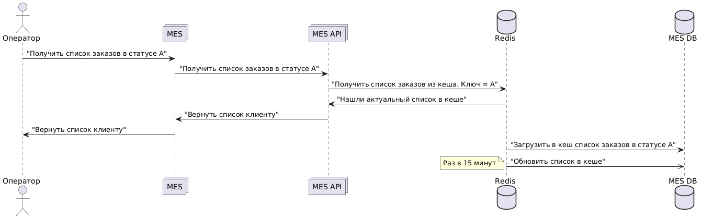

# Мотивация

В продукте наблюдаются проблемы с производительностью. В первую очередь это касается системы MES и работы с дашбордом
заказов и API.

Метрики на которые повлияет внедрение кеширования:

- Увеличение скорости отклика. Кеширование позволяет значительно сократить время, необходимое для обработки запросов,
  так как данные могут быть извлечены из кеша вместо того, чтобы запрашивать их из базы данных или других источников
- Снижение нагрузки на сервер.Кеширование уменьшает количество запросов к основным ресурсам (например, базам данных),
  что снижает нагрузку на серверы и позволяет им обрабатывать большее количество одновременных запросов. Это особенно
  важно в связи с текущими проблемами системы с производительностью
- Увеличение пропускной способности. За счет уменьшения времени обработки запросов и снижения нагрузки на серверы,
  кеширование может повысить общую пропускную способность системы
- Увеличение удовлетворенности пользователей. Быстрый доступ к данным и улучшенное время отклика могут повысить
  удовлетворенность пользователей, что в свою очередь может привести к увеличению удержания клиентов и росту продаж
- Увеличение конверсии. Улучшение производительности системы за счет кеширования может положительно сказаться на
  конверсии

## Какие места будем кешировать и почему

- MES API, SHOP API, CRM (заказы) - работа с заказаыми - ключевой элемент системы где внедрение серверного кеширования
  сразу даст быстрый результат
- MES, CRM, Internet Shop - (файлы) - внедрение клиенского кеширования для загруженных файлов клиента
- Shop API, CRM API (инфо о клиенте, справочники) - внедряем клиенское кеширование для данных которые редко меняются.
  Дополнительно можно реализовать и серверное кеширование этих данных

# Предлагаемое решение

## Клиенское кеширование

Клиенское кеширование предлагается внедрить для данных которые редко меняются (или не меняются совсем).

- MES, CRM, Internet Shop - (файлы) - внедрение клиенского кеширования для загруженных файлов клиента
    - Cache-Control: private, max-age=315360000
    - В качестве Etag может выступать md5 хеш файла
- Shop API, CRM API (инфо о клиенте, справочники) - внедряем клиенское кеширование для данных которые редко меняются.
  Дополнительно можно реализовать и серверное кеширование этих данных
    - Cache-Control: private, max-age=3600
    - В качестве Etag может выступать дата последнего обновления или версия документа

## Серверное кеширование

Ключевым компонентом который необходимо кешировать является список заказов для отображения дашборда MES. 
В связи с тем что работа с заказом распределена между 3 сервисами, то для данной сущности лучше подойдет серверное кеширование для избежания неконсистентного состояния заказа. 
Для консистентности данных лучше использовать не локальный кеш, а **распределенный через Redis**

**Кешируем** 
 - Списки заказов (по статусам)
 - Заказ

**Параметры кеширования**

- **Стратегия вытеснения**: Least recently used - Вытеснение давно неиспользуемых. Так как нам показывать только самые новое заказы по каждому из статусов
- **Размер кеша**: 100 - показываем только последние заказы за несколько дней
- **TLL**: 15 минут - важно поддерживать актуальный статус заказа в случае системных ошибок
- **Паттерн кеширования**: Cache-Aside + Refresh-ahead. Наша задача максимально оптимизировать именно скорость операций чтения. Для этого лучше всего подходят паттерн Cache-Aside. Refresh-ahead позволит обновить данные в кеше без воздействия на пользователей, с учетом того что, мы запланировали внедрение системы мониторинга - вероятность ошибки будет невелика  
- **Стратегии инвалидации**:
  - Временная инвалидация (ttl для списков и одиночного заказа)
  - Программная инвалидация (в случае списка заказов)
  - Инвалидация по ключу (в случае заказа)

## Чтение заказов

## Обновление статуса заказа

## Стратегии инвалдиации кеша

| Временная инвалидация                                                                                                                                                                                         | Инвалидация, основанная на запросах                                                                                                                             | Инвалидация на основе изменений                                     | Программная инвалидация                                                                                     | Инвалидация по ключу                               |
|---------------------------------------------------------------------------------------------------------------------------------------------------------------------------------------------------------------|-----------------------------------------------------------------------------------------------------------------------------------------------------------------|---------------------------------------------------------------------|-------------------------------------------------------------------------------------------------------------|----------------------------------------------------|
| Лушче подходит, потому что мы планируем использовать паттерн Cache-Aside в котором обновление проиходит напрямую в бд и в случае ошибки с обновлением кеша необходимо чтобы приложение обновило его состояние | Не подходит нам потому что запросов на создание/изменение заказов может быть много, если будем инвалидировать кеш на каждый запрос то будет много cache-miss ов | Не подходит потому, что придется много информации запрашивать из БД | Подходит нам потому что нам требуется тонко управлять кешем в приложении в случае обновления статуса заказа | Подходит для обновления статуса конкретного заказа |

